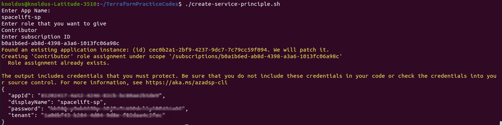

## Short Description about this template
This shell script helps to create Service principle in Azure.

---

### Steps for Execution 
1. Go to the terminal or any IDE.
2. Login into AZ account using `az login` or `az login --tenant <TENANT-ID>` .
3. Change the permission of the script using `chmod a+x create-service-principle.sh`
4. Run the script using this command : `./create-service-principle.sh`

After run the script it take value at runtime for creating Service Principle.

